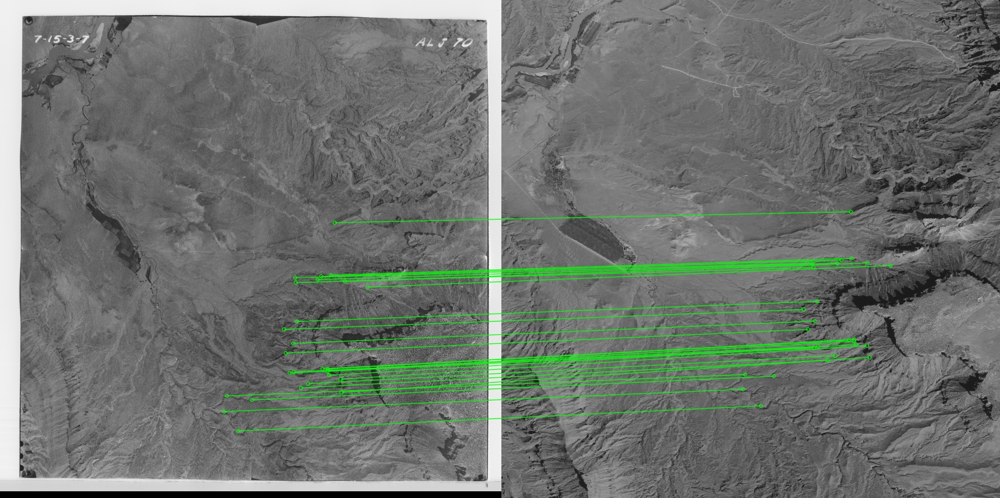
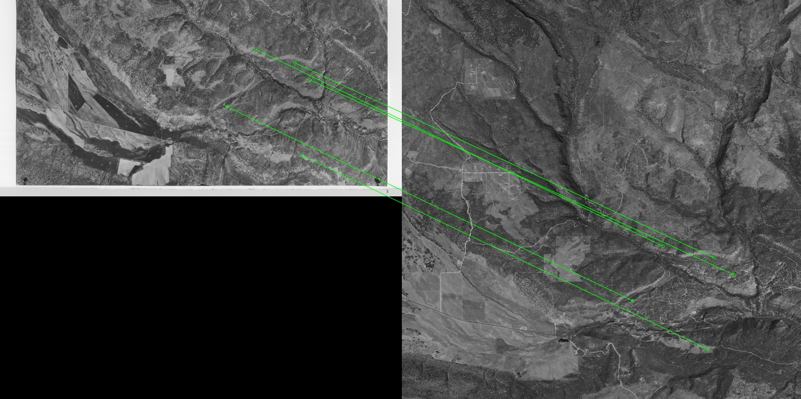
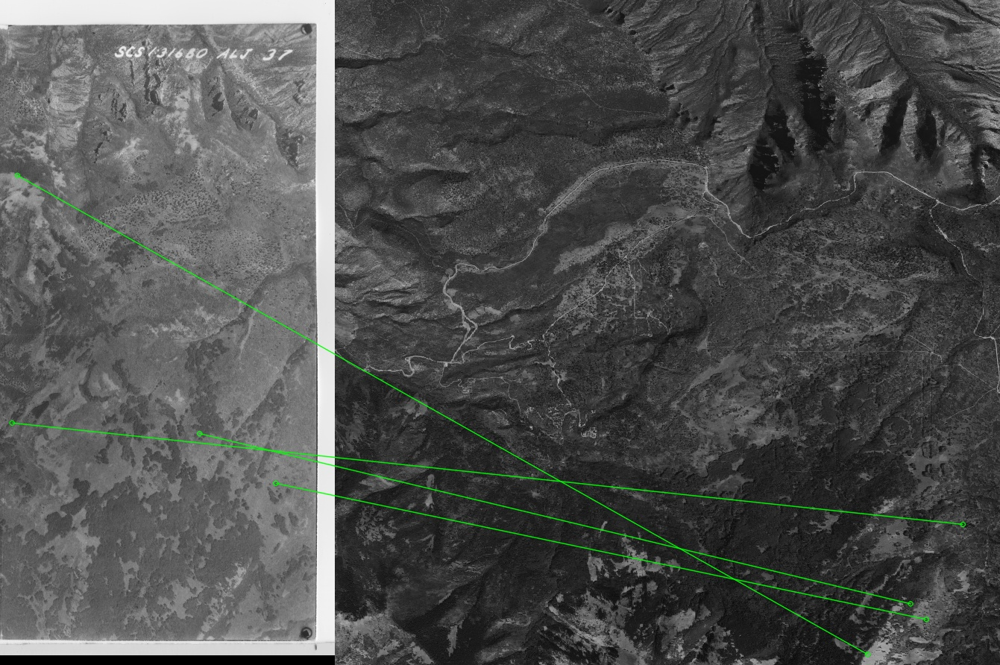

# Modified-SIFT-Algorithm

The UGS_Modified_Feature_Detection implements a length and slope filter on the OpenCV SIFT algorithm. The filter increases the accuracy of the matches SIFT finds. This algorithm was designed to automatically georeference images. The image set used for testing can be found at: 

https://imagery.geology.utah.gov/pages/search.php?search=%21collection21441+&k=&modal=&display=thumbs&order_by=date&offset=0&per_page=350&archive=&sort=DESC&restypes=&recentdaylimit=&foredit=&noreload=true&access=

The algorithm will try to match the following image pairs if not enough matches are found: original image with NAIP image, upper half of original image with NAIP image, lower half of original image with NAIP image, left half of original image with NAIP image, and the right half of original image with NAIP image. 

### Examples of Good Matches

### Examples of Not Enough Matches

